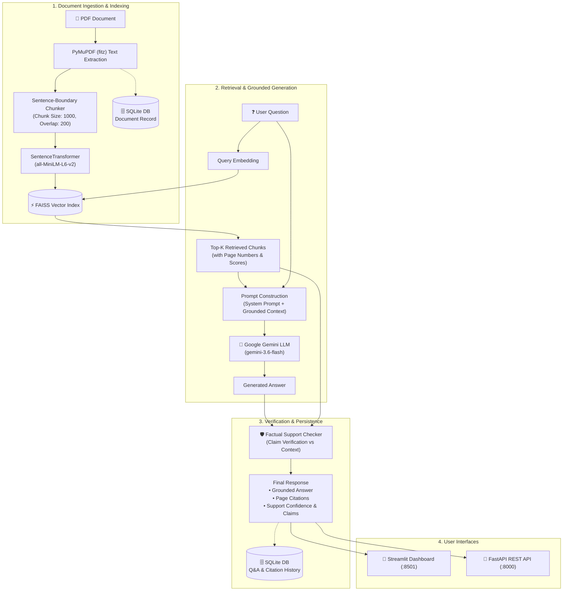

# VeriDoc

VeriDoc is an enterprise-grade, containerized AI document intelligence platform that extracts knowledge from PDF documents using Retrieval-Augmented Generation (RAG). It combines fast semantic vector search, large language model generation, transparent page-level source citations, and an automated factual support/hallucination verification layer.

---

## Overview

Traditional document search relies on rigid keyword matching that often misses nuanced conceptual queries. Conversely, querying pure LLMs on proprietary documents leads to hallucinations or truncated context windows.

**VeriDoc bridges this gap using a verifiable Retrieval-Augmented Generation (RAG) architecture:**
- **Accurate Ingestion**: Extracts text page-by-page from PDFs while preserving document structure and page numbers.
- **Semantic Understanding**: Converts text passages into dense vector embeddings that capture semantic intent.
- **Fast Similarity Search**: Employs FAISS (Facebook AI Similarity Search) to retrieve the top relevant passages in sub-milliseconds.
- **Grounded Answering**: Constrains Google Gemini (`gemini-3.6-flash`) strictly to retrieved document context.
- **Factual Verification**: Automatically scores and verifies whether every claim in the generated answer is directly supported by the retrieved document evidence.
- **Persistent Memory**: Retains document metadata, full Q&A history, source citations, and verification verdicts in a persistent SQLite database.

---

## Key Features

- 📄 **PDF Extraction & Ingestion**: Robust text and metadata extraction from PDF files using PyMuPDF (`fitz`), handling multi-page layouts and blank pages gracefully.
- ✂️ **Sentence-Boundary-Aware Chunking**: Configurable text splitting with sliding-window overlap that respects punctuation boundaries to prevent semantic mid-sentence truncations.
- 🧠 **Dense Semantic Embeddings**: Generates 384-dimensional dense vectors using `sentence-transformers/all-MiniLM-L6-v2`.
- ⚡ **FAISS Vector Store**: High-speed Cosine/L2 similarity vector indexing and nearest-neighbor search.
- 🤖 **Context-Grounded Q&A**: LLM-powered answer generation using Google Gemini (`gemini-3.6-flash`) instructed to refuse out-of-context answering.
- 📌 **Exact Source & Page Citations**: Every answer includes full attribution containing document name, exact page number, chunk ID, character count, and similarity score.
- 🛡️ **Support & Hallucination Checking**: Built-in verification engine analyzing answer claims against source text, producing confidence scores and classifications (`supported`, `partially_supported`, `unsupported`, `insufficient_evidence`).
- 💬 **Multi-Question Conversational UX**: Continuous Q&A sessions over indexed documents without re-uploading or re-indexing.
- 🗄️ **Persistent Database Storage**: Relational SQLite storage via SQLAlchemy for document catalogs, question logs, citation data, and audit records.
- 🔌 **FastAPI REST Backend**: Fully documented OpenAPI/Swagger endpoints for document ingestion, statistics, semantic search, and history management.
- 🎨 **Streamlit Web Interface**: Clean, dual-column UI with interactive document viewers, real-time chunk inspectors, citation accordions, and support badges.
- 🐳 **Docker & Docker Compose**: Multi-service containerization with non-root security, persistent named volumes, and pre-cached embedding weights.

---

## Architecture



---

## RAG Pipeline

1. **PDF Processing (`backend/services/pdf_processor.py`)**:
   PyMuPDF opens and validates uploaded PDF files, extracting clean UTF-8 text page-by-page while tracking page numbers and character counts.
2. **Text Chunking (`backend/services/chunker.py`)**:
   Splits text into chunks (default 1,000 chars, 200 char overlap) using regex sentence boundaries (`. `, `! `, `? `, `\n\n`) to preserve semantic coherence.
3. **Embedding Generation (`backend/services/embeddings.py`)**:
   Encodes chunks into 384-dimensional dense vectors using `sentence-transformers/all-MiniLM-L6-v2` with normalized L2 vectors for cosine similarity computation.
4. **Vector Store (`backend/services/vector_store.py`)**:
   Builds an in-memory `IndexFlatIP` FAISS index associating vector IDs directly with chunk metadata.
5. **Semantic Retrieval (`backend/services/retrieval.py`)**:
   Embeds incoming user queries and executes top-K nearest-neighbor search, returning scored evidence chunks.
6. **Answer Generation (`backend/services/generator.py`)**:
   Formats a grounded system prompt combining the retrieved evidence and user query, calling Google Gemini (`gemini-3.6-flash`) with temperature 0.2.
7. **Support Checking (`backend/services/support_checker.py`)**:
   Verifies whether the generated statements are substantiated by the retrieved passages, assigning confidence scores and claim breakdowns.
8. **Relational Persistence (`backend/database/`)**:
   Saves document metadata and Q&A interactions to SQLite via SQLAlchemy ORM models.

---

## Tech Stack

| Component | Technology | Description |
|---|---|---|
| **Language** | Python 3.12 | Modern type-annotated Python runtime |
| **PDF Extraction** | PyMuPDF (`fitz`) | Fast, high-fidelity PDF text extraction |
| **Text Embeddings** | Sentence-Transformers | Local transformer inference (`all-MiniLM-L6-v2`) |
| **Vector Search** | FAISS (`faiss-cpu`) | High-speed dense similarity indexing |
| **LLM Inference** | Google Gemini (`google-genai`) | `gemini-3.6-flash` for grounded answering |
| **REST Backend** | FastAPI & Uvicorn | Asynchronous RESTful API with Pydantic v2 schemas |
| **Frontend UI** | Streamlit | Interactive data and document Q&A dashboard |
| **ORM & Database** | SQLAlchemy & SQLite | Relational persistence for documents & history |
| **Testing & QA** | pytest, pytest-cov, httpx | 136 unit, integration, and regression tests |
| **Containerization** | Docker & Docker Compose | Multi-container architecture with volume sharing |

---

## Project Structure

```text
VeriDoc/
│
├── backend/
│   ├── main.py                     # FastAPI application entrypoint, CORS & health check
│   ├── api/                        # REST API route handlers
│   │   ├── __init__.py
│   │   ├── documents.py            # PDF upload, document stats & metadata endpoints
│   │   └── questions.py            # Question answering, retrieval & history endpoints
│   │
│   ├── database/                   # Persistence & ORM layer
│   │   ├── __init__.py
│   │   ├── models.py               # SQLAlchemy models (DocumentRecord, QuestionRecord)
│   │   ├── repository.py           # CRUD repository functions
│   │   └── session.py              # Engine, sessionmaker, and DB initialization
│   │
│   ├── models/                     # Data contracts & Pydantic schemas
│   │   ├── __init__.py
│   │   └── schemas.py              # Request/response schemas & validation
│   │
│   └── services/                   # Core RAG business logic
│       ├── __init__.py
│       ├── pdf_processor.py        # PDF extraction & error handling
│       ├── chunker.py              # Sentence-boundary text chunking
│       ├── embeddings.py           # Embedding generation via SentenceTransformers
│       ├── vector_store.py         # FAISS vector store management
│       ├── retrieval.py            # Semantic retrieval service
│       ├── generator.py            # Gemini RAG answer generator
│       ├── support_checker.py      # Factual support & hallucination verification
│       └── rag_pipeline.py         # Unified end-to-end RAG orchestrator
│
├── frontend/
│   └── app.py                      # Streamlit interactive web application
│
├── data/                           # Local runtime data (volume-mounted in Docker)
│   ├── documents/                  # Staging for uploaded PDF documents
│   ├── vector_store/               # Stored FAISS index files & metadata
│   └── veridoc.db                  # SQLite database file
│
├── tests/                          # Comprehensive automated test suite
│   ├── conftest.py                 # Pytest fixtures & mock objects
│   ├── test_pdf_processor.py       # PDF extraction unit tests
│   ├── test_chunker.py             # Chunking unit tests
│   ├── test_embeddings.py          # Embedding generation tests
│   ├── test_vector_store.py        # FAISS vector store unit tests
│   ├── test_retrieval.py           # Semantic retrieval tests
│   ├── test_generator.py           # Gemini generation & refusal tests
│   ├── test_support_checker.py     # Hallucination & support verification tests
│   ├── test_rag.py                 # RAG orchestrator unit tests
│   ├── test_rag_e2e_pipeline.py    # End-to-end multi-step integration tests
│   ├── test_database.py            # SQLite database & repository tests
│   ├── test_question_history.py    # Persistent Q&A history tests
│   ├── test_api.py                 # FastAPI endpoint integration tests
│   ├── test_citations.py           # Citation accuracy & schema tests
│   ├── test_frontend.py            # Streamlit UI integration tests
│   └── test_edge_cases_and_security.py # Security & boundary condition tests
│
├── Dockerfile                      # Production Docker container definition
├── docker-compose.yml              # Multi-container Compose configuration
├── .dockerignore                   # Build context exclusions
├── .env.example                    # Environment variable configuration template
├── .gitignore                      # Git repository exclusions
├── pyproject.toml                  # Project metadata & coverage configuration
├── pytest.ini                      # Pytest runner settings & markers
└── requirements.txt                # Python package dependencies
```

---

## Installation & Local Setup

### 1. Prerequisites

- Python 3.11 or 3.12 installed
- Git installed
- Google Gemini API key ([Get a Gemini API Key](https://aistudio.google.com/))

### 2. Clone the Repository

```bash
git clone https://github.com/chithrithamk/VeriDoc.git
cd VeriDoc
```

### 3. Create & Activate Virtual Environment

**Windows (PowerShell / Command Prompt):**
```powershell
python -m venv .venv
.venv\Scripts\activate
```

**Linux / macOS:**
```bash
python3 -m venv .venv
source .venv/bin/activate
```

### 4. Install Dependencies

```bash
pip install --upgrade pip
pip install -r requirements.txt
```

---

## Gemini API Configuration

VeriDoc uses the official Google GenAI SDK (`google-genai`) configured with `gemini-3.6-flash`.

1. Copy the example environment template:
   ```bash
   cp .env.example .env
   ```
2. Edit `.env` to provide your API key:
   ```env
   # LLM Configuration
   GEMINI_API_KEY=your_actual_gemini_api_key_here
   GEMINI_MODEL=gemini-3.6-flash

   # Database & Storage
   DATABASE_URL=sqlite:///./data/veridoc.db
   ```

> **Security Reminder**: Never commit `.env` or expose API keys publicly. `.env` is listed in `.gitignore` and `.dockerignore`.

---

## Running Locally

### Starting the FastAPI Backend

Run the REST API with auto-reload:

```bash
uvicorn backend.main:app --host 0.0.0.0 --port 8000 --reload
```

- **Swagger UI**: [http://localhost:8000/docs](http://localhost:8000/docs)
- **ReDoc**: [http://localhost:8000/redoc](http://localhost:8000/redoc)
- **Health Check**: [http://localhost:8000/health](http://localhost:8000/health)

### Starting the Streamlit Frontend

In a separate terminal (with the virtual environment activated):

```bash
python -m streamlit run frontend/app.py
```

- **Web Dashboard**: [http://localhost:8501](http://localhost:8501)

---

## API Documentation

VeriDoc provides full REST API support via FastAPI:

| Method | Endpoint | Description |
|---|---|---|
| `GET` | `/` | Root status message and API version |
| `GET` | `/health` | Health check, vector store readiness & DB status |
| `POST` | `/documents/upload` | Ingest PDF, build FAISS index, save DB record |
| `GET` | `/documents/` | List all persisted document records |
| `GET` | `/documents/stats` | Active document name, page count & vector count |
| `GET` | `/documents/{doc_id}` | Retrieve document metadata by UUID |
| `GET` | `/documents/{doc_id}/questions` | Retrieve all Q&A history for a specific document |
| `DELETE` | `/documents/clear` | Clear active in-memory document index |
| `POST` | `/questions/ask` | Query document, generate answer, verify support & record history |
| `GET` | `/questions/history` | List all Q&A history records across documents |
| `GET` | `/questions/history/{question_id}` | Retrieve specific Q&A record by UUID |
| `DELETE` | `/questions/history/{question_id}` | Delete specific Q&A history item |
| `DELETE` | `/questions/history` | Clear Q&A history without deleting documents |

### Example Request & Response: `POST /questions/ask`

**Request:**
```json
{
  "question": "What is the return on investment described in the report?",
  "top_k": 3
}
```

**Response:**
```json
{
  "id": "e4a8b2d1-9f3c-4a82-8b65-71c4e92a1104",
  "document_id": "b1f83c20-7b24-4d91-8841-3a059b5821c9",
  "document_name": "annual_financial_report.pdf",
  "question": "What is the return on investment described in the report?",
  "answer": "According to page 4 of the report, the project delivered an annualized return on investment (ROI) of 24.5% over the three-year evaluation period.",
  "sources": [
    {
      "chunk_id": 12,
      "page_number": 4,
      "document_name": "annual_financial_report.pdf",
      "char_count": 482,
      "text": "Financial Summary: Over the three-year evaluation cycle, the initiative generated an annualized return on investment (ROI) of 24.5%...",
      "similarity_score": 0.892
    }
  ],
  "support": {
    "status": "supported",
    "confidence": 0.95,
    "explanation": "The retrieved context explicitly confirms an annualized ROI of 24.5% over three years.",
    "supported_claims": [
      "The project delivered an annualized return on investment (ROI) of 24.5% over a three-year period."
    ],
    "unsupported_claims": []
  },
  "created_at": "2026-09-15T10:00:00.000000"
}
```

---

## Docker Deployment

VeriDoc includes a production-ready container definition based on `python:3.12-slim`.

### Multi-Container Setup with Docker Compose (Recommended)

```bash
# Build images and start services
docker compose up --build

# Run in background (detached)
docker compose up -d --build

# Stop all running containers
docker compose down
```

### Standalone Docker Containers

**1. Build the Docker Image:**
```bash
docker build -t veridoc:latest .
```

**2. Run FastAPI Backend:**
```bash
docker run -d \
  --name veridoc-api \
  -p 8000:8000 \
  -e GEMINI_API_KEY="your_api_key_here" \
  -v veridoc-data:/app/data \
  veridoc:latest
```

**3. Run Streamlit Frontend:**
```bash
docker run -d \
  --name veridoc-frontend \
  -p 8501:8501 \
  -e GEMINI_API_KEY="your_api_key_here" \
  -v veridoc-data:/app/data \
  veridoc:latest \
  streamlit run frontend/app.py --server.port=8501 --server.address=0.0.0.0
```

### Container Architecture Highlights
- **Layer Caching**: Dependencies installed before application code.
- **Pre-baked Embedding Model**: `all-MiniLM-L6-v2` downloaded at build time into `/app/.cache/huggingface` for instant startup.
- **Non-Root User**: Runs under unprivileged `appuser` (UID 1000).
- **Persistent Storage**: Shared Docker volume `veridoc-data` mounts to `/app/data` to persist SQLite records, uploads, and FAISS indices.

> *Note on Local Development*: Docker configuration and files are statically validated. When running on environments without the Docker daemon installed, use the local Python virtual environment workflow.

---

## Automated Testing & Quality Assurance

VeriDoc maintains an extensive automated test suite with **136 tests** and **0 failures**.

```text
======================= 136 passed in 18.90s =======================
```

- **Backend Code Coverage**: ~93%
- **Overall Code Coverage**: 83.6%
- **Zero Live API Cost**: All Gemini API calls are mocked using strict behavioral fixtures.
- **Full Isolation**: Database tests use in-memory SQLite instances or isolated temporary fixtures with automatic cleanup.

### Running Tests

```bash
# Run complete test suite
pytest -v

# Run with test coverage report
pytest --cov=backend --cov=frontend tests/

# Run specific test modules
pytest tests/test_rag_pipeline.py -v
pytest tests/test_support_checker.py -v
pytest tests/test_api.py -v
pytest tests/test_database.py -v
```

---

## Security & Best Practices

- **Zero Hardcoded Secrets**: All API keys are loaded strictly from the environment or `.env`.
- **Repository Safety**: `.env`, database binaries (`*.db`), vector indexes, and caches are ignored by `.gitignore` and `.dockerignore`.
- **Sandboxed Container**: Dockerfile enforces non-root execution via `USER appuser`.
- **Input Validation**: Pydantic v2 schemas and FastAPI validation prevent malformed queries, invalid file types, and out-of-range chunk parameters.
- **Safe SQL Operations**: Uses SQLAlchemy parameterized ORM queries to prevent SQL injection.

---

## Limitations

- **Single Active Document Index**: The current in-memory FAISS store indexes one active document at a time for fast interactive sessions. Historical documents remain cataloged in SQLite.
- **Evidence-Based Support Checking**: The hallucination checker evaluates consistency strictly against the retrieved chunks rather than external ground truth.
- **Dense-Only Retrieval**: Uses dense semantic vector embeddings. Highly specific alphanumeric serial numbers or code snippets may benefit from hybrid BM25 + dense search in future iterations.

---

## Future Roadmap

- 🔍 **Hybrid Retrieval & Reranking**: Combining BM25 keyword search with dense embeddings and cross-encoder reranking.
- 📚 **Multi-Document Collections**: Cross-document query routing and filtering by collection tags.
- 👥 **Multi-Tenant User Authentication**: User account management with role-based access control (RBAC).
- 🐘 **PostgreSQL / pgvector Integration**: Scalable enterprise vector and metadata persistence.
- 📊 **Telemetry & Observability**: OpenTelemetry tracing for latency and retrieval performance analytics.
